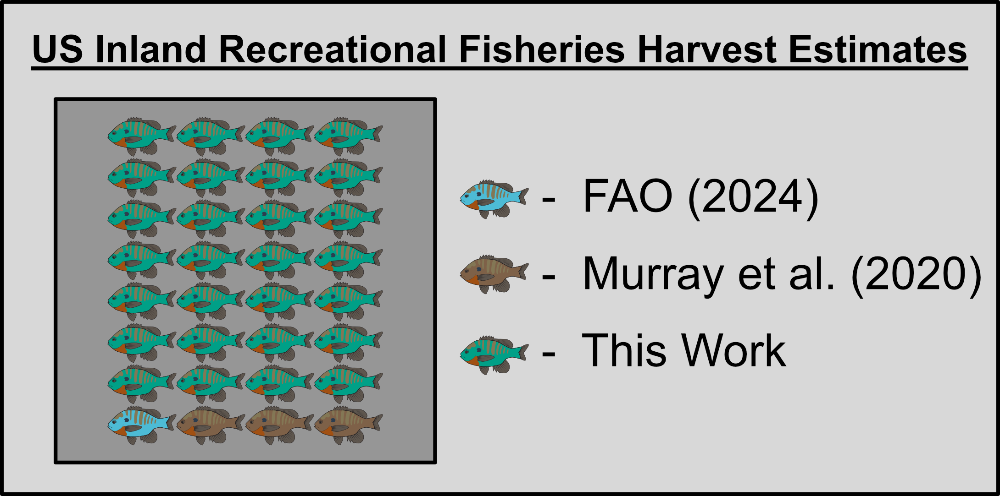

US Inland Harvest
================
Matthew Robertson
2025-02-04

# Citation

Robertson, M.D. 2025. Inland recreational fisheries harvest far exceeds
reported inland harvest in the United States: Zenodo code release.
<https://doi.org/10.5281/zenodo.14781046>.

# Contact

Author - [Matthew D. Robertson](matthew.robertson@mi.mun.ca), Marine
Institute of Memorial University Point of Contact - [Abigail J.
Lynch](ajlynch@usgs.gov), USGS Climate Adaptation Center

# Summary

This is the code accompanying Robertson et al. (Submitted) where we
estimated that inland recreational fisheries in the US harvest 16 - 43
times more fish than are reported to the Food and Agriculture
Organization of the United Nations (FAO).

# Code purpose and order

This code is intended to allow readers/reviewers the ability to repeat
analyses in the paper.

1.  The first script to run is `Preparing_CreelCat_Data.R`. This script
    will load the csv files downloaded from the [CreelCat
    database](https://rconnect.usgs.gov/CreelCat/) and then prepare them
    following methods described in detail from [Robertson et
    al. (2024)](https://doi.org/10.1111/fme.12650) to be used in the
    CreelCatch model. If you don’t want to run the script and just want
    to access the final output of the script, you can simply open
    `Data\Model_dat.RData`.

2.  The second script to run is `Downloading_NHD_Data.R`. This script
    will load NHD data from every state and format it to be used for
    projections in a later script. This loading process is very slow and
    unless you plan to modify something about what is loaded, you can
    just open the saved output saved as
    `Data\all_states_nhd_for_modeling.RData`.

3.  The third script to run is `Running_CreelCatch_Model.R`. This script
    will use the CreelCat data within the `CreelCatch.cpp` model to
    estimate parameters relating fishing effort and catch, which will be
    used to project national harvest.If you don’t want to run the script
    and just want to access the final output of the script, you can
    simply open `Model_output.RData`.

4.  Finally, the last script is `Projecting_US_Harvest.R`. This script
    will use model outputs and the NHD data to project effort, catch,
    and harvest across waterbodies in the US.

# File descriptions

`CreelCatch.cpp` - C++ file containing the model and likelihood
functions implemented by the TMB package

`CreelCatch.dll` - Dynamic link library for the compiled
`CreelCatch.cpp` file

`CreelCatch.o` - Object file for the compiled `CreelCatch.cpp` file

`Downloading_NHD_Data.R` - R script for loading every state’s NHD data
and combining it into a single file for modeling and projection

`LICENSE.md` - Creative commons CC0 1.0 Universal license details

`Model_output.RData` - R Data file containing the outputs from the model
run used in the manuscript

`Preparing_CreelCat_Data.R` - R script for CreelCat data processing

`Projecting_US_Harvest.R` - R script for combining model outputs with
projection assumptions to calculate projected fishing effort, catch, and
harvest

`README.Rmd` - README R Markdown file

`README.md` - README file formatted for Github

`Running_CreelCatch_Model.R` - R script for using processed CreelCat
data with the CreelCatch model

`US_Inland_Harvest.Rproj` - R project file housing the code and data
within this repository

`results_comparison_updated.png` - Conceptual diagram comparing
recreational inland harvest estimates from multiple sources. Fish
represent 10,000 tonnes of harvested fish from inland recreational
fisheries. Different colors represent estimates from different
references. Each reference builds on the last, where the [FAO
(2024)](https://doi.org/10.4060/cd0683en) estimate only ~10,000 tonnes,
[Murray et al. (2020)](https://doi.org/10.1002/fsh.10483) estimate
~40,000 tonnes, and we estimate ~ 320,000 tonnes.

`Data` - Folder containing data downloaded from the CreelCat database as
well as .RData files created using Rscripts in this project

`Data\AngEffort_Data.csv` - Angler effort comma separated values file
from the CreelCat database

`Data\FishDataCompiled.csv` - Fish catch and harvest comma separated
values file from the CreelCat database

`Data\Model_dat.RData` - R Data file containing the data inputs for the
CreelCat Model

`Data\Survey_Data.csv` - Angler Effort Data comma separated file from
the CreelCat database

`Data\all_states_nhd_for_modeling.RData` - R Data file containing the
NHD data that was downloaded, to be used in modeling and projections

# Disclaimer

This software has been approved for release by the Climate Adaptation
Science Centers. No warranty, expressed or implied, is made as to the
functionality of the software and related material nor shall the fact of
release constitute any such warranty. Furthermore, the software is
released on condition that the Climate Adaptation Science Centers shall
not be held liable for any damages resulting from its authorized or
unauthorized use.

# Acknowledgements

This data release was supported by Grant Award No. G20AC00464 from the
U.S. Geological Survey National Climate Adaptation Science Center.
